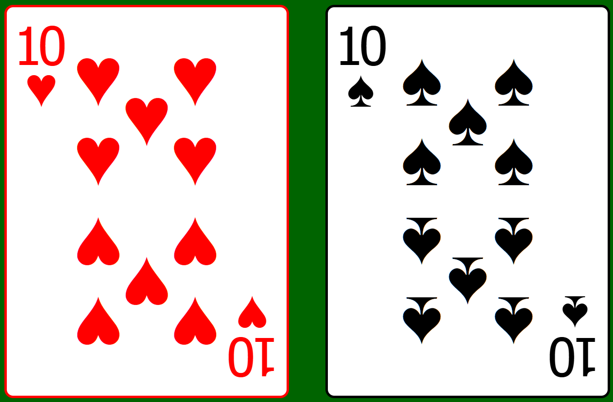
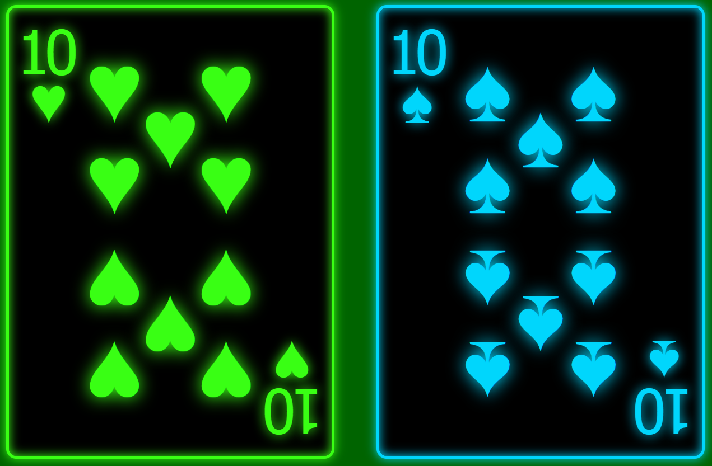

# Pure HTML/CSS playing cards, with a regular and cyberpunk version!

## Usage
A single card consists of the following div:
```html
    <div class="card">
        <span class="card__value"></span>
        <span class="card__minisuit"></span>
        <span class="card__mainsuit"></span>        
    </div>
```

To create a card, add one suit class and one value class to the main div with the card class. See examples below.

## All properties of the card are controlled via the main div classes
- Available suit classes: 'spades', 'hearts', 'diamonds', 'clubs'
- Available value classes: 'v2', 'v3', 'v4', 'v5', 'v6', 'v7', 'v8', 'v9', 'v10', 'vJ', 'vQ', 'vK', 'vA'
- Available optional classes: 'cyberpunk', 'back'

## Examples:
### To create a ten of hearts, you would use the following div
```html
    <div class="card hearts v10">
        <span class="card__value"></span>
        <span class="card__minisuit"></span>
        <span class="card__mainsuit"></span>        
    </div>
```


### To use the special 'cyberpunk' version of the cards, just add the class 'cyberpunk' to the main div, along with the suit and value classes
```html
    <div class="card hearts v10 cyberpunk">
        <span class="card__value"></span>
        <span class="card__minisuit"></span>
        <span class="card__mainsuit"></span>        
    </div>
```


### To create a back of a card, you would use the following div (also available in cyberpunk version)
```html
    <div class="card back">
        <span class="card__value"></span>
        <span class="card__minisuit"></span>
        <span class="card__mainsuit"></span>        
    </div>
```


### To change the size of a specific card, you can add a style attribute to the main div or change the .card font-size in style.css
```html
    <div class="card spades vK" style="font-size: 50px;">
        <span class="card__value"></span>
        <span class="card__minisuit"></span>
        <span class="card__mainsuit"></span>        
    </div>
```

## Additional info
- The order of the classes does not matter.
- The 'back' class shouldn't include any suit or value classes. However, it can also include the 'cyberpunk' class.
- To change the size of the card, you can either modify the 'font-size' in .card in style.css file, or add a style attribute to the main div with the desired font-size.
- The card uses Tahoma font family to make sure all symbols are displayed correctly. WARNING: changing the font-family may cause the cards to not display correctly.

## License
This project is licensed under the MIT License - see the [LICENSE.md](LICENSE.md) file for details.